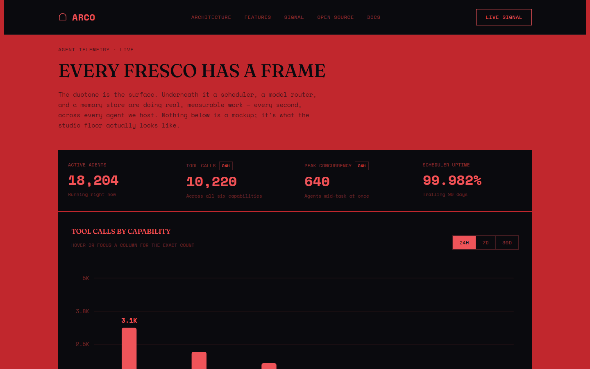

# Arco

**The infrastructure layer beneath autonomous agents** — memory, automation,
and on-chain perception, engineered like a Renaissance arch: load-bearing,
precise, built to outlast whatever gets painted on top of it.

[](LICENSE)
[](https://github.com/arcotechagent/arcoagent/actions/workflows/deploy.yml)
[](https://arcotechagent.github.io/arcoagent/)


## What is Arco

Arco runs the same loop under every agent it hosts — **perceive → reason →
act → remember** — across chat platforms, files, webhooks, and on-chain
events, with a model router, tiered sandboxing, and a durable memory store
underneath. Read the full breakdown in [`docs/ARCHITECTURE.md`](docs/ARCHITECTURE.md).



## Repo contents

This repository holds the public site and the asset pipeline behind it —
plain HTML/CSS/JS, no framework, no build step to view it.

```
.
├── index.html              # the site — nav, hero, architecture, features, telemetry, footer
├── public/art/              # pre-baked duotone + halftone Renaissance art (static PNGs)
├── scripts/bake-art.mjs     # one-time Node script that generates public/art/ from source paintings
├── docs/ARCHITECTURE.md     # how the perceive/reason/act/remember loop actually works
├── LICENSE                  # MIT
└── package.json             # only dependency is `sharp`, used solely by bake-art.mjs
```

## Running it locally

There's no build step — open `index.html` directly, or serve the folder with
anything static:

```bash
npx http-server .
# or: python -m http.server
```

## Regenerating the art

The Renaissance paintings under `public/art/` are already committed as
pre-baked static PNGs — the page never processes images at runtime. Re-run
the bake only if you change a crop or source in `scripts/bake-art.mjs`:

```bash
npm install
npm run bake-art
```

Source credits are listed in `public/art/CREDITS.txt`.

## Contributing

See [`CONTRIBUTING.md`](CONTRIBUTING.md).

## License

MIT — see [`LICENSE`](LICENSE).
