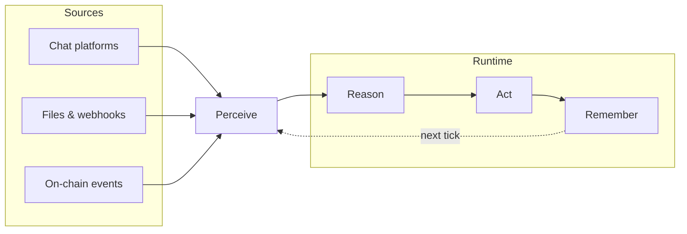
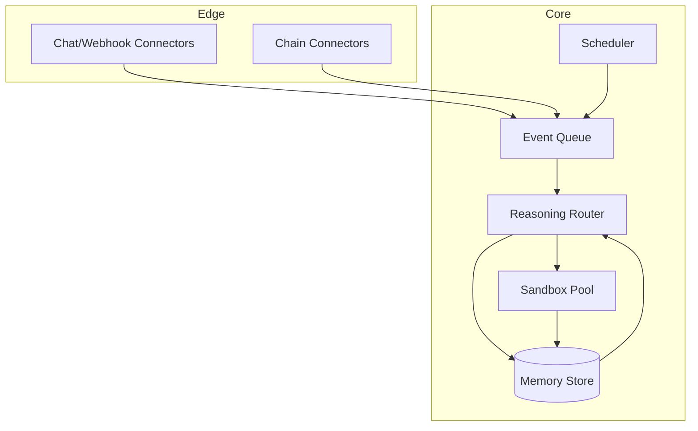

# Arco Architecture

This document describes how Arco is put together: the perceive → reason → act
→ remember loop every agent runs on, the systems around that loop, and the
guarantees each layer makes to the ones next to it. It's aimed at anyone
integrating with Arco, operating a deployment, or contributing to the
runtime.

If you only read one section, read [The Loop](#the-loop) — everything else in
this document is detail hung off that one cycle.

## Contents

- [The Loop](#the-loop)
- [Perception](#1-perception)
- [Reasoning](#2-reasoning)
- [Action](#3-action)
- [Memory](#4-memory)
- [Scheduler](#scheduler)
- [On-Chain Perception](#on-chain-perception)
- [Deployment Topology](#deployment-topology)
- [Data Model](#data-model)
- [Design Principles](#design-principles)

## The Loop

Every agent in Arco runs the same four-stage cycle. Nothing skips a stage,
and nothing writes directly to memory without passing through reasoning and
action first — that ordering is what keeps an agent's history trustworthy.



A single pass through the loop is a **tick**. A tick is triggered by an
inbound event (a message, a webhook, a scheduled job firing, a watched
contract emitting a log) — Arco does not poll for work by default, since
polling scales badly past a few hundred agents.

## 1. Perception

The perception layer is the only part of the system allowed to touch the
outside world for input. Every connector — chat platform, filesystem watcher,
webhook receiver, chain indexer — normalizes what it sees into a single
envelope shape before it ever reaches an agent:

```json
{
  "id": "evt_8f2a1c",
  "source": "telegram",
  "occurred_at": "2026-09-12T09:14:03Z",
  "priority": "normal",
  "payload": { "...": "source-specific body" }
}
```

Normalization does three things, in order:

1. **Dedupe** — a content hash against the last N events from the same
   source, so a flaky webhook retry doesn't create two ticks.
2. **Timestamp and order** — source clocks aren't trusted; Arco stamps
   `occurred_at` on receipt and orders strictly by that stamp.
3. **Rank** — a lightweight priority classifier (not the main reasoning
   model — this has to be cheap) sorts the inbound queue so a direct mention
   doesn't wait behind a low-priority background sync.

Connectors are intentionally dumb. They don't interpret content, they don't
decide what an agent should do about an event — they only translate a
source-specific shape into the envelope above and hand it off.

## 2. Reasoning

Reasoning is a routing decision before it's a generation: given the event,
the agent's active memory, and the tools available, which model should
handle this, and with what budget?

```
score(model) = capability_fit(task) - λ · cost(model) - μ · latency(model)
```

The router starts at the cheapest model that plausibly fits the task
profile and escalates up a fixed chain only when the response's confidence
score falls below threshold, or when a tool call the model requests isn't in
its allowed set. Escalation is logged — a disproportionate escalation rate
for a given task type is usually a sign that task's routing tier is
misconfigured, not that the model is weak.

Reasoning outputs one of three things: a direct reply, a tool call, or a
decision to defer (write a memory note and end the tick without acting —
correct when the agent doesn't yet have enough context to act safely).

## 3. Action

Every tool call is dispatched into one of three sandbox tiers, chosen by the
risk of the call, not by which agent is asking:

| Tier | Example calls | Isolation |
|---|---|---|
| **Read-only** | search, fetch, read a file | No write access to any system; runs in-process |
| **Write-scoped** | send a message, edit a file, queue a job | Scoped credentials, single external system, rate-limited |
| **Fully isolated** | run code, execute an on-chain transaction | Ephemeral container or remote worker, network-egress allowlist, killed on tick end |

A tool call never chooses its own tier — the tier is a property of the tool
definition, set when the tool is registered, not something an agent can
elevate at request time. This is the one piece of the architecture that
isn't configurable per-deployment on purpose.

## 4. Memory

Memory is written once per tick, after action completes, never during it.
Each write is:

1. **Compressed** — the raw tick (event, reasoning trace, tool calls, result)
   is summarized into a short natural-language note plus structured
   metadata, not stored verbatim. Verbatim transcripts are kept in cold
   storage for audit, separately from what the agent actually recalls.
2. **Embedded** — the note is embedded and indexed alongside its metadata
   (source, timestamp, related entities).
3. **Linked** — where the tick relates to an existing memory (same project,
   same conversation thread, same on-chain address), the new note is linked
   rather than duplicated, so retrieval returns one coherent thread instead
   of five overlapping fragments.

Retrieval at the start of the next tick is hybrid: a recency-weighted pass
over the active thread, plus a relevance pass over the full store, merged
and deduplicated before the reasoning layer ever sees it. Pure similarity
search over the whole store — with no recency term — is what causes an
agent to "forget" what it did five minutes ago in favor of something
superficially similar from three months back; Arco weights against that
by default.

## Scheduler

Scheduled work is parsed from natural language ("every weekday at 9am,
summarize open PRs") into a standard job spec, then handled by the same
tick machinery as any other event — a fired schedule is just another entry
in the perception queue, tagged with its job id. Retries use exponential
backoff with a cap; a job that fails past its retry budget raises to the
owner rather than silently dropping.

## On-Chain Perception

Chain connectors watch three signal types per configured address or
contract: transfers, contract events (via ABI-decoded logs), and — for
addresses under active watch — mempool activity, surfaced before
confirmation for latency-sensitive workflows. Every on-chain signal carries
its confirmation depth in its envelope, so reasoning can treat a
zero-confirmation mempool sighting differently from a finalized transfer
without special-casing chain logic outside the perception layer.

## Deployment Topology



The core is designed to run as a single process for small deployments (a
laptop, a single VM) or split across workers per component for larger ones
— the event queue is the only hard boundary between them, so scaling out is
a matter of moving a subgraph to its own process without touching the logic
inside it.

## Data Model

The three durable record types, in the shape they're persisted:

- **Event** — the normalized envelope from [Perception](#1-perception),
  retained in cold storage for audit.
- **Memory** — the compressed, embedded, linked note from
  [Memory](#4-memory); what an agent actually recalls.
- **Trace** — the full reasoning + action record for one tick, used for
  debugging and for the telemetry surfaced on the [Arco
  site](../index.html#signal).

## Design Principles

- **A tick is atomic.** Perceive, reason, act, remember happen in that
  order or not at all — there's no partial-tick state an agent can resume
  from, which makes replay and debugging tractable.
- **Connectors don't reason, and the router doesn't touch tools directly.**
  Keeping those boundaries strict is what lets each layer be tested and
  replaced independently.
- **Isolation is a property of the tool, not the caller.** See
  [Action](#3-action) — this is the one rule the architecture doesn't bend
  on.
- **Memory is a summary, not a transcript.** Cheap to recall, expensive to
  audit only when you actually need to, by design.
